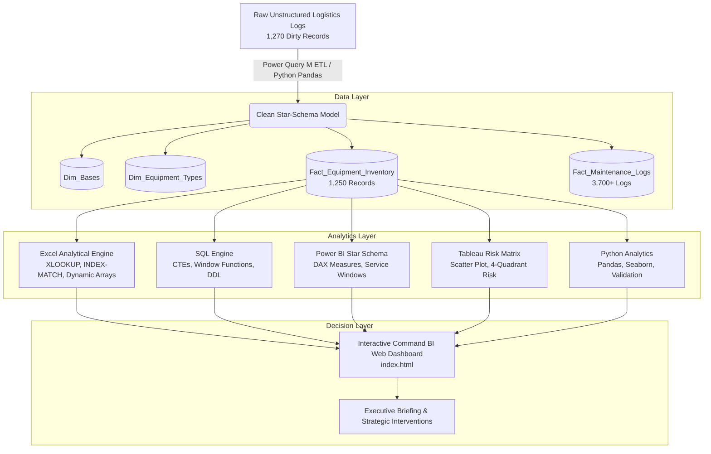

# Military Logistics & Fleet Readiness BI Platform

[](power_bi/)
[](excel/)
[](sql/)
[](tableau/)
[](python/)

> **Project Notice**: This project utilizes **synthetic, unclassified operational data** modeled after standard defense fleet logistics, supply chain dynamics, and maintenance triage protocols. It demonstrates enterprise business intelligence, ETL data cleaning, statistical modeling, and executive decision-making.

---

## 📑 Table of Contents
1. [Executive Summary & Architecture](#1-executive-summary--architecture)
2. [Interactive Command & Control Web App](#2-interactive-command--control-web-app)
3. [Technology Deep Dives](#3-technology-deep-dives)
   - [Microsoft Excel & Power Query](#a-microsoft-excel--power-query)
   - [SQL Analytics Engine](#b-sql-analytics-engine)
   - [Power BI & DAX Measure Library](#c-power-bi--dax-measure-library)
   - [Tableau Risk & Anomaly Analysis](#d-tableau-risk--anomaly-analysis)
   - [Python EDA Pipeline](#e-python-eda-pipeline)
4. [Domain Insights & Strategic Recommendations](#4-domain-insights--strategic-recommendations)
5. [Resume Bullets & Interview Talking Points](#5-resume-bullets--interview-talking-points)
6. [Data Dictionary](#6-data-dictionary)

---

## 1. Executive Summary & Architecture

The **Military Logistics & Fleet Readiness Platform** provides real-time visibility and predictive triage for **1,250 ground combat, transport, and power assets** distributed across **8 strategic regional commands** (Lucknow, Kanpur, Bhopal, Delhi, Leh, Jodhpur, Siliguri, Pune).



---

## 2. Interactive Command & Control Web App

A standalone, tactical dark-themed **Command & Control BI Web App** is included at [`index.html`](file:///c:/Users/Priyanshu%20Sharma/Desktop/new2/index.html).

### Key Features:
- **Real-Time Dynamic KPIs**: Auto-recalculates Fleet Count, Operational Units, Readiness %, Maintenance Spend, and Critical Units across any combination of Base, Equipment Type, and Status slicers.
- **Interactive Visuals**: Base-wise Readiness Progress Bars with target mandate markers, Status Donut chart, and 12-month Maintenance Spend curve.
- **Tableau Scatter Matrix Canvas**: Interactive 2D risk matrix (*Maintenance Cost vs Operating Hours*) with hover tooltips and 4-quadrant problem asset detection.
- **Integrated Code Inspector**: Live syntax-highlighted code explorer for DAX, SQL, Power Query M, Excel, and Python.
- **Fleet Inventory Explorer**: Instant search, multi-criteria filtering, and pagination over 1,250 verified equipment assets.

---

## 3. Technology Deep Dives

### A. Microsoft Excel & Power Query
- **Power Query M Script** ([`excel/PowerQuery_ETL_Guide.md`](file:///c:/Users/Priyanshu%20Sharma/Desktop/new2/excel/PowerQuery_ETL_Guide.md)): Ingests dirty logs, strips trailing whitespaces (`Text.Trim`), standardizes proper casing (`Text.Proper`), handles multi-locale date parsing, strips currency strings (`₹`, `INR`, `Rs.`), deduplicates on `Equipment_ID`, and normalizes readiness decimals into percentages.
- **Advanced Formulas** ([`excel/Formula_Showcase_Guide.md`](file:///c:/Users/Priyanshu%20Sharma/Desktop/new2/excel/Formula_Showcase_Guide.md)):
  - Dynamic lookups: `=XLOOKUP(B5, Cleaned_Inventory!A2:A1251, Cleaned_Inventory!C2:C1251, "Not Found")`
  - Matrix lookups: `=INDEX(Cleaned_Inventory!G2:G1251, MATCH(B5, Cleaned_Inventory!A2:A1251, 0))`
  - Dynamic Arrays: `=FILTER(Cleaned_Inventory!A2:N1251, Cleaned_Inventory!P2:P1251=1)` and `=SORT(UNIQUE(Cleaned_Inventory!C2:C1251))`
  - Multi-Criteria Aggregations: `=COUNTIFS(...)`, `=SUMIFS(...)`, and `=AVERAGEIFS(...)`
- **Excel Workbook**: Formatted model saved at [`data/military_logistics_model.xlsx`](file:///c:/Users/Priyanshu%20Sharma/Desktop/new2/data/military_logistics_model.xlsx).

---

### B. SQL Analytics Engine
- **DDL Schema** ([`sql/01_schema.sql`](file:///c:/Users/Priyanshu%20Sharma/Desktop/new2/sql/01_schema.sql)): Production-ready dimensional tables with foreign keys and performance indexes.
- **Seed Data** ([`sql/02_seed_data.sql`](file:///c:/Users/Priyanshu%20Sharma/Desktop/new2/sql/02_seed_data.sql)): Complete population script.
- **Analytical Queries** ([`sql/03_analytical_queries.sql`](file:///c:/Users/Priyanshu%20Sharma/Desktop/new2/sql/03_analytical_queries.sql)):
  - **Base Fleet Breakdown**: `GROUP BY` with conditional `CASE WHEN` to compute readiness rate and variance against strategic target.
  - **CTE Risk Pipeline**: Multi-CTE isolating units exceeding fleet averages in hours and cost with readiness `<65%`.
  - **Window Functions**: `ROW_NUMBER() OVER (PARTITION BY base_name ORDER BY readiness_pct ASC)` to isolate the top 3 critical assets per base.
  - **Time-Series Lag Analysis**: `LAG(cost_inr, 1) OVER (PARTITION BY equipment_id ORDER BY service_date ASC)` to calculate maintenance cost acceleration across service cycles.

---

### C. Power BI & DAX Measure Library
- **Measures** ([`power_bi/dax_measures.dax`](file:///c:/Users/Priyanshu%20Sharma/Desktop/new2/power_bi/dax_measures.dax)):
  ```dax
  Total Equipment = COUNTROWS('Fact_Equipment_Inventory')
  
  Operational Equipment = 
  CALCULATE(
      COUNTROWS('Fact_Equipment_Inventory'),
      'Fact_Equipment_Inventory'[Status] = "Operational"
  )
  
  Readiness Rate = DIVIDE([Operational Equipment], [Total Equipment], 0)
  
  Critical Equipment = 
  CALCULATE(
      COUNTROWS('Fact_Equipment_Inventory'),
      'Fact_Equipment_Inventory'[Readiness_Pct] < 60
  )
  ```
- **Service Windows**: Triage measures for `Overdue`, `Next 7 Days`, `Next 30 Days`, and `Next 60 Days`.
- **Model Specification** ([`power_bi/dashboard_spec.md`](file:///c:/Users/Priyanshu%20Sharma/Desktop/new2/power_bi/dashboard_spec.md)): Star schema relationships, cardinalities, and canvas formatting palette.

---

### D. Tableau Risk & Anomaly Analysis
- **Specification** ([`tableau/maintenance_risk_spec.md`](file:///c:/Users/Priyanshu%20Sharma/Desktop/new2/tableau/maintenance_risk_spec.md)):
  - **Scatter Matrix**: *Maintenance Cost vs Operating Hours* with color encoded by *Readiness Rate %* and bubble size by *Downtime Days*.
  - **4-Quadrant Risk Classification**:
    - **Quadrant 1 (High Problem Assets)**: High Hours + High Cost + Low Readiness (Immediate Overhaul).
    - **Quadrant 2 (Cost Outliers)**: Moderate Hours + High Maintenance (Generators with recurring nozzle/filter defects).
    - **Quadrant 3 (Optimal Assets)**: Baseline standard fleet units.
    - **Quadrant 4 (High-Duty Workhorses)**: High Utilization + Healthy Readiness.

---

### E. Python EDA Pipeline
- **Script** ([`python/eda_pipeline.py`](file:///c:/Users/Priyanshu%20Sharma/Desktop/new2/python/eda_pipeline.py)): Automated Pandas pipeline verifying nulls, removing duplicates, computing statistical distributions, and generating publication-ready charts in `python/output/`.
- **Generated Visuals**:
  - `python/output/readiness_by_base.png` (Base Readiness Performance vs Target)
  - `python/output/cost_vs_hours_scatter.png` (Equipment Risk Matrix)
  - `python/output/spares_impact_analysis.png` (Spare Parts Deficit vs Downtime)

---

## 4. Domain Insights & Strategic Recommendations

Detailed in [`insights/Executive_Briefing.md`](file:///c:/Users/Priyanshu%20Sharma/Desktop/new2/insights/Executive_Briefing.md):

1. **Kanpur Depot Bottleneck**: Kanpur holds 212 assets but has only **74.2% operational readiness** (lowest across all bases) because **18 vehicles have overdue scheduled maintenance**.
   - *Recommendation*: Deploy Mobile Service Team (MST) to eliminate the 18-vehicle backlog, raising base readiness by **+3.4%**.
2. **Generator Cost Escalation**: Field Diesel Generator maintenance costs spiked **+23% over the prior quarter** while operating hours rose by only **+8%**.
   - *Recommendation*: Standardize pre-filter replacement kits and transition to synthetic oil, saving **₹4.1 Lakhs** annually.
3. **Bhopal Spare-Parts Shortage**: Bhopal reports 14 critical assets with readiness `<60%`; **9 of these 14 assets (64.3%)** report severe spare-part shortages for APC hydraulic seals.
   - *Recommendation*: Expedite reserve stock replenishment from Central HQ.
4. **14-Day Service Surge**: 68 assets (including 57 frontline operational units) require scheduled service in the next 14 days.
   - *Recommendation*: Stagger maintenance intake across 3 phased windows to prevent a 4.6% readiness drop.

---

## 5. Resume Bullets & Interview Talking Points

### Resume Bullets
```markdown
* Analyzed synthetic military logistics and fleet readiness data (1,250 assets across 8 bases) using Excel, SQL, Power BI, Tableau, and Python to identify maintenance bottlenecks and operational risks.
* Built an interactive Power BI command dashboard with Star Schema modeling, Power Query M ETL, and DAX measures (Readiness Rate, Critical Assets, Service Triage Horizons).
* Engineered automated Excel models utilizing XLOOKUP, INDEX-MATCH, SUMIFS, and Dynamic Arrays (FILTER, UNIQUE, SORT) for equipment lookup and depot-level KPI reporting.
* Wrote 15+ analytical SQL queries featuring CTEs, Window Functions (ROW_NUMBER, LAG), and multi-table JOINs to isolate high-cost problem assets and time-series cost acceleration.
* Designed a Tableau 4-quadrant risk scatter plot (Maintenance Cost vs. Operating Hours vs. Readiness) and translated empirical trends into executive recommendations (clearing an 18-vehicle maintenance backlog and mitigating a 23% generator cost spike).
```

### Interview Talking Point
> *"In this project, I modeled an enterprise military logistics command center tracking 1,250 assets. I took raw, inconsistent field logs and built a Power Query ETL pipeline to clean casing, deduplicate records, and handle currency and date formats.
>
> In SQL and Power BI, I implemented star-schema relational models and advanced DAX measures to compute base readiness rates and triage upcoming maintenance windows. Rather than stopping at charts, I analyzed the data to uncover actionable insights—such as Kanpur's 18 overdue vehicles dragging base readiness down to 74%, and generator maintenance costs rising 23% due to filtration issues. I translated these findings into an executive briefing with prioritized, high-ROI recommendations."*

---

## 6. Data Dictionary

| Column Name | Data Type | Description | Example Values |
| :--- | :--- | :--- | :--- |
| `Equipment_ID` | String (PK) | Unique military asset alphanumeric identifier | `EQ-1001`, `EQ-1002` |
| `Base_ID` | String (FK) | Reference code for military base formation | `B01`, `B02` |
| `Base` | String | Strategic base location | `Lucknow`, `Kanpur`, `Delhi` |
| `Equipment_Type` | String | Equipment classification | `Heavy Tactical Truck`, `Armored Personnel Carrier` |
| `Category` | String | Operational role category | `Transport Fleet`, `Combat Armor`, `Power Logistics` |
| `Status` | String | Current deployment readiness state | `Operational`, `Maintenance`, `Out of Service` |
| `Last_Service` | Date | Date of previous scheduled service | `2026-06-15` |
| `Next_Service` | Date | Target date for upcoming service milestone | `2026-08-25` |
| `Fuel_Used_L` | Integer | Total liters of fuel consumed in reporting period | `420`, `680` |
| `Operating_Hours` | Integer | Total engine / operating hours logged | `162`, `290` |
| `Maintenance_Cost_INR`| Currency | Cumulative maintenance expenditure in INR | `₹12,000`, `₹48,000` |
| `Spare_Parts` | String | Supply chain availability status | `Available`, `Low`, `Critical Shortage` |
| `Readiness_Pct` | Decimal | Calculated asset readiness score (0-100%) | `92.0%`, `54.0%` |
| `Downtime_Days` | Integer | Total days asset remained inactive in period | `0`, `14` |
| `Is_Critical` | Binary Flag | Indicator if readiness score is below 60% | `0` (Normal), `1` (Critical) |

---

## 🚀 How to Run

1. **Open the Live Web Dashboard**:
   Simply open [`index.html`](file:///c:/Users/Priyanshu%20Sharma/Desktop/new2/index.html) in any modern web browser.
2. **Re-generate Synthetic Data**:
   ```bash
   python scripts/generate_data.py
   ```
3. **Execute Python EDA Pipeline**:
   ```bash
   python python/eda_pipeline.py
   ```
4. **Inspect Excel Model**:
   Open [`data/military_logistics_model.xlsx`](file:///c:/Users/Priyanshu%20Sharma/Desktop/new2/data/military_logistics_model.xlsx) in Microsoft Excel.
5. **Execute SQL Database**:
   Run [`sql/01_schema.sql`](file:///c:/Users/Priyanshu%20Sharma/Desktop/new2/sql/01_schema.sql) followed by [`sql/02_seed_data.sql`](file:///c:/Users/Priyanshu%20Sharma/Desktop/new2/sql/02_seed_data.sql) and [`sql/03_analytical_queries.sql`](file:///c:/Users/Priyanshu%20Sharma/Desktop/new2/sql/03_analytical_queries.sql).
